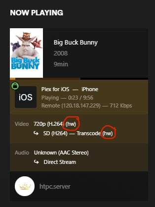

# Proxmox Plex LXC with HW Encoding on MINISFORUM-UM773 Lite Ryzen7 7735HS
After many weeks of trial and error I finally manage to get Hardware encoding working with a Plex Proxmox container on the Minisforum UM773 Lite Ryzen7 7735HS. Its not difficult, it actually eqsier then conventional passthrough method that we so used to, going into it with previous experience of PCI and GPU passthrough that got me into trouble.

# Prequesite 
Assume you already have Proxmox 8 installed.

# BIOS Setting
First thing Go to bios and disable IOMMU. Yes disable it.. this what got me stump for days. If you enable it, proxmox wont install the drivers and the /dev/dri directory will be empty and this is the dir you need to passthrough to plex lxc

# Getting the GPU PCI ID
We need to get the GPU PCI ID using this command:

`lspci -nn | grep -e ‘AMD/ATI’`

The result should get something like this

```
34:00.0 VGA compatible controller [0300]: Advanced Micro Devices, Inc. [AMD/ATI] Rembrandt [Radeon 680M] [1002:1681] (rev 0a)
34:00.1 Audio device [0403]: Advanced Micro Devices, Inc. [AMD/ATI] Rembrandt Radeon High Definition Audio Controller [1002:1640]
```
Note GPU: 1002:1681

Audio Device: 1002:1640

# Adding the PCI ID / Preload to vfio.conf
Add options vfio-pci ids=1002:1681,1002:1640 to /etc/modprobe.d/vfio.conf

`nano /etc/modprobe.d/vfio.conf`

and add the following now it should look like this

```
options vfio-pci ids=1002:1681,1002:1640
softdep radeon pre: vfio-pci
softdep amdgpu pre: vfio-pci
softdep snd_hda_intel pre: vfio-pci
```

# Enable vfio in kernel modules
Add the kernel modules to enable vfio to nano /etc/modules

```
vfio
vfio_iommu_type1
vfio_pci
vfio_virqfd
```

# Edit/Update the GRUB
Now, at this step most instruction will add iommu command which i found will not work, just leave it as default. It should look like below, if no change it and update grub.

```
GRUB_DEFAULT=0
GRUB_TIMEOUT=5
GRUB_DISTRIBUTOR=`lsb_release -i -s 2> /dev/null || echo Debian`
GRUB_CMDLINE_LINUX_DEFAULT="quiet"
GRUB_CMDLINE_LINUX=""
```

update-grub 

update-initramfs -u -k all

# Checking the /dev/dri 
Reboot, and check /dev/dri directory should not be empty.

```
root@PROXMOX:~# ls -l /dev/dri
total 0
drwxr-xr-x 2 root root         80 Aug  5 23:24 by-path
crw-rw---- 1 root video  226,   0 Aug  5 23:24 card0
crw-rw---- 1 root render 226, 128 Aug  5 23:24 renderD128
```

# Installing Plex via TTeck scripts
Install plex from here https://tteck.github.io/Proxmox/#plex-media-server-lxc with the following script

`bash -c "$(wget -qLO - https://github.com/tteck/Proxmox/raw/main/ct/plex.sh)"`
 
Choose Advance and yes to privilege, as install as privilege will add passthrough mount and groups. Look in

`nano /etc/pve/lxc/100.conf`

It should look something like this (replace 100 with your own container).

```
arch: amd64
cores: 2
features: fuse=1,nesting=1
hostname: plex
memory: 2048
net0: name=eth0,bridge=vmbr0,hwaddr=BC:24:11:69:04:9B,ip=dhcp,type=veth
onboot: 0
ostype: ubuntu
rootfs: local:107/vm-107-disk-0.raw,size=8G
swap: 512
tags: proxmox-helper-scripts
lxc.cgroup2.devices.allow: a
lxc.cap.drop:
lxc.cgroup2.devices.allow: c 188:* rwm
lxc.cgroup2.devices.allow: c 189:* rwm
lxc.cgroup2.devices.allow: c 226:* rwm
lxc.cgroup2.devices.allow: c 195:* rwm
lxc.cgroup2.devices.allow: c 243:* rwm
lxc.cgroup2.devices.allow: c 509:* rwm
lxc.cgroup2.devices.allow: c 29:0 rwm
lxc.mount.entry: /dev/serial/by-id   dev/serial/by-id   none bind,optional,create=dir
lxc.mount.entry: /dev/ttyUSB0        dev/ttyUSB0        none bind,optional,create=file
lxc.mount.entry: /dev/ttyUSB1        dev/ttyUSB1        none bind,optional,create=file
lxc.mount.entry: /dev/ttyACM0        dev/ttyACM0        none bind,optional,create=file
lxc.mount.entry: /dev/ttyACM1        dev/ttyACM1        none bind,optional,create=file
lxc.mount.entry: /dev/fb0            dev/fb0            none bind,optional,create=file
lxc.mount.entry: /dev/dri            dev/dri            none bind,optional,create=dir
lxc.mount.entry: /dev/dri/renderD128 dev/dri/renderD128 none bind,optional,create=file
lxc.mount.entry: /dev/vfio           dev/vfio           none bind,optional,create=dir
lxc.mount.entry: /dev/dvb            dev/dvb            none bind,optional,create=dir 0 0
```

You dont have to passthrough every device like this but since i only use it as a headless plex box leave it as is so everytime i plug in eg the TV tunner i dont have to edit the file again.

# Adding permission for pled user
Open the plex container console and add plex user to the video card group for permission. Add one at a time to watch for errors.

```
usermod -a -G video plex
usermod -a -G render plex
usermod -a -G input plex
usermod -a -G ssl-cert plex
```

# Stream and confirm HW Enconding work
Reboot and stream something to your phone or devices that doesn't support direct play so it will force to transcode. Look in your plex dashboard it should show what is playing with the word transcode (HW). See your CPU usage it should be minimum. If the word (hw) is not there then your CPU usage will shoot to 100% that means it not working.



